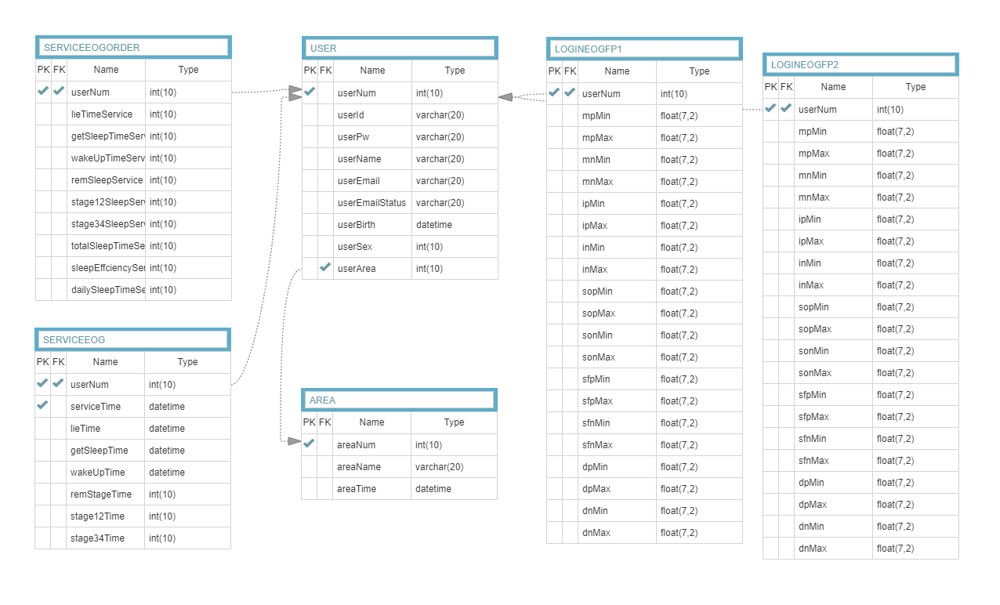

# refactor-gp-backend

## 웹화면 기능

- 회원가입
- 로그인 로그아웃
- 회원정보 수정, 비밀번호 수정
- 9가지 수면분석 결과조회
- 분석결과를 시각화(차트)하여 제공
- 개인화 설정 ; 메인화면 레이아웃 수정
- 하이브리드앱에서 동작가능한 반응형웹

## 서버 기능 (갱글리온 라우터)

- 자바클라이언트(뇌파 전송 프로그램)으로부터 수신받은 정보 핸들
- 실시간으로 수신받은 뇌파정보로 수면분석 실행 (수면 단계 파악)
- 파악된 수면 단계를 기반으로 LED조절
- 수면종료(로그아웃)하면 측정된 데이터를 기반으로 웹에 보여질데이터 생성

## ERD

| table           | desc                                   |
| --------------- | -------------------------------------- |
| USER            | 유저 정보 테이블                       |
| SERVICEEOGORDER | 메인화면에서 보여지는 카드 순서 테이블 |
| SERVICEEOG      | 수면 정보 테이블                       |
| AREA            | 지역 테이블                            |
| LOGINEOGFP1     | 유저 생체 데이터 FP1                   |
| LOGINEOGFP2     | 유저 생체 데이터 FP2                   |

## 개선기록

- 커밋내역 확인

## 개선사항

- ...
