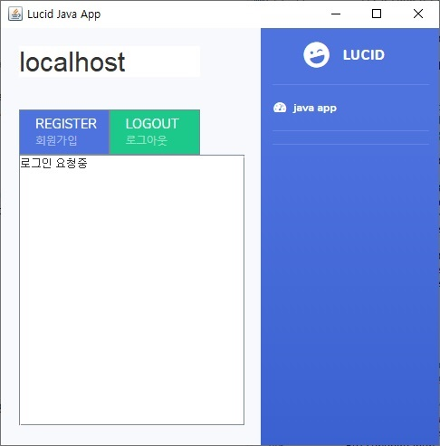

# refactor-gp-java-client

- Open BCI의 뇌파 데이터를 서버로 전송하는 프로그램
- gradle프로젝트로 재구성
- 소스 코드 리팩토링 없음..

## 기능

- Open BCI의 뇌파 데이터를 서버로 전송
- 프로그램을 실행하면 자동으로 로그인 시도
- 처음 사용자면 회원가입 버튼을 통해 회원가입 api로 뇌파 전송
- 회원가입 성공시 자동으로 로그인 시도
- 로그아웃 버튼으로 뇌파 전송 종료 및 프로그램 종료
- 로그인 성공시 중앙 텍스트에리어에 로그인 정보 표시 및 수면분석 api로 뇌파 전송

## 주요 파일

### lucid.txt

- 서버 아이피를 세팅하는 config file
- 서버 포트는 `65002`로 고정

### resources/

- jframe에 들어가는 이미지 파일들 경로
